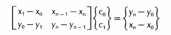
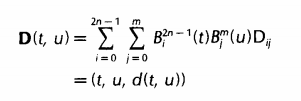
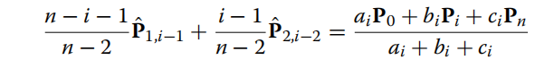

# Bezier裁剪

## 1990：

对两条Bezier曲线Q(s)和P(t)求交集。取Q(s)的端点q0和qn作为基线，直线方程为$ax+by+c=0$，对Q(s)的所有控制点求点到基线的距离，求得所有控制点到基线的距离范围$[dmin, dmax]$。

对P(t)求其曲线到Q(s)基线的距离，选择其中距离在$[dmin, dmax]$范围内的子区间作为下一次递归的输入区间。

具体做法为对每个控制点$P_i(x_i,y_i,z_i)$，有$d_i=ax_i+by_i+c$，$d(t)=\sum_{i=0}^nd_iB_i^n(t)_i$.为了保证t变化均匀，设D(t)为非参数Bezier曲线，$D(t)=(t,d(t))=\sum_{i=0}^nD_iB_i^n(t)$，$D_i=(t_i,d_i)$，$t_i=i/n$.

先使用凸包性质筛选，若P(t)控制点围成的凸包与$[dmin, dmax]$没有重合区域，则返回空集。若P(t)子区间凸包与其相交，则计算凸包与d=min和d=max的交点横坐标，使用两次de Casteljau算法，剔除曲线P(t)在交集外的部分。如果单次剔除效果不明显，认为可能有多个交点，从子区间中部将曲线分成两个子曲线，对子曲线重复上述操作。

交替对两条曲线的一条求fat line，另一条求子区间，直到结果到达预设精度内。

求fat line时，如果目标是二次曲线，则fat line宽度可以缩减到常规的1/2，如果是三次曲线，可以直接求出最大值，但是会有额外性能损耗，因此一般使用控制点到基线最大距离的4/9作为fat line宽度。

如果求子区间的曲线是一条有理曲线，由于分母上权重参数的存在，直接通过凸包计算子区间效果不佳。可以设新的非有理曲线，并求其与d=0的交集，再求得子区间。公式为$\sum_{i=0}^nw_i(ax_i+by_i+c-d_{max})B_i^n(t)>0$和$\sum_{i=0}^nw_i(ax_i+by_i+c+d_{min})B_i^n(t)<0$.

### 求切点和处理多交点问题：

设Bezier曲线的焦点曲线为一条通过所有与曲线垂直的直线所形成的曲线，不断缩小焦点曲线的范围，最后两个输入曲线的焦点曲线缩小到点状，连接两点得到两条bezier曲线的公共法线。这条法线可以最大限度分离两个交点，提高算法效率。

对曲线P(t)求焦点曲线 $F(t) = P(t) + c(t)N(t)$ ，N(t)是与P(t)垂直的向量，c(t)是任意关于t的函数。设H(t)是P(t)的导矢，他可以表示为一个n-1度的Bezier曲线，控制点是 n (Pi + 1 - Pi)。通过将H(t)旋转90°可以得到与P(t)垂直的向量N(t)。另外设$c(t)=c_0（1-t)+c_1t$. 通过下式计算两个参数。

从而保证F(t)成为一个首位相接的曲线，使得其包围的区域相对小。

接下来，求另一条曲线Q(s)上有哪些法线可以与F(t)相交，计算s所在的区间，并裁剪Q(s)。接着对P(t)进行同样的操作，并不断交替裁剪两条曲线。在不断裁剪的过程中，两条曲线的焦点曲线会逐渐缩小，直到达到预设精度。

具体做法是建立一个Bezier曲面：

求曲面凸包与d=0的交点围成的子区间，作为下一次迭代的初始区间，不断重复直到达到预设精度。

## 2012：

求fat line和fat curve的相交区域。

fat line的求法与上文相同，对另一条曲线P(t)求近似曲线fat curve。使用降次公式将原曲线f(t)降为2或3次曲线p(t)，并计算原曲线与p(t)的误差范围作为fat curve的上下界。由于2、3次方程的根可以直接使用求根公式得出，不需要使用凸包性质，提升了算法效率。其他的计算流程与1990年的算法相同。

误差范围的具体计算方法为先将f(t)降次为P(t)，再将P(t)升阶到与f(t)阶数相同，并比较P(t)与f(t)每个控制点的误差，将误差的最值作为p(t)与fat curve边界的偏移量。

## 2022：

提出混合曲线的概念。对于任意一条度数大于3的Bezier曲线，存在一个等效的混合曲线P(t)，包含两个固定的控制点$P_0$和$P_3$和两个移动控制点$P_1$和$P_2$，对于固定控制点，沿用原曲线的两端控制点；移动控制点是度数为n-3的Bezier曲线，控制点分别为$\left\{\hat{P}_{1,i-1}\right\}_{i=1}^{n-2}$和$\left\{\hat{P}_{2,i-1}\right\}_{i=1}^{n-2}$.其中

$*a_i=−(n−i)(n−i−1)(n−i−2),b_i=n(n−1)(n−2),c_i=−i(i−1)(i−2), i∈{1,…,n−1}.*$

在后面的计算中，让P(t)被两个曲线包围，这两个曲线是通过限定$P_1$和$P_2$得到的。具体而言，下届函数m的控制点是P1，P2的最小值，M的控制点是P1，P2的最大值。

因为两个移动控制点存在线性关联，可以通过固定一个移动控制点为常量，移动另一个控制点得到两个等价的曲线方程。设曲线P(t)为这两条曲线的混合，即$(1-\lambda)\hat{{Q}}(t)+\lambda\hat{{R}}(t)=\hat{{P}}(t)$。在计算时根据两种曲线方程涉及的控制点的波动范围的区别，选择波动范围更小的那一个，即控制$\lambda=1$或$\lambda=0$.

由于上下界曲线的次数在3次以内，可以直接使用解析式求出其与fat line边界的交点。

在3D曲线相交的情况，只需要对Q(s)求fat plane，也就是连接Q(s)的两端点和任意控制点形成的平面，并对所有控制点计算到该平面的距离。其他步骤与2D的情况相同。