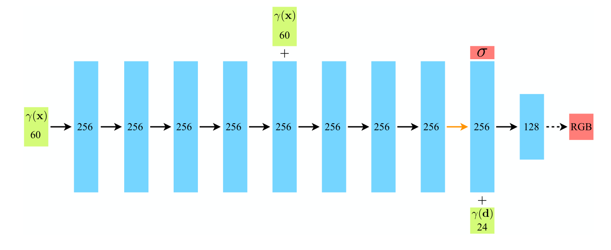
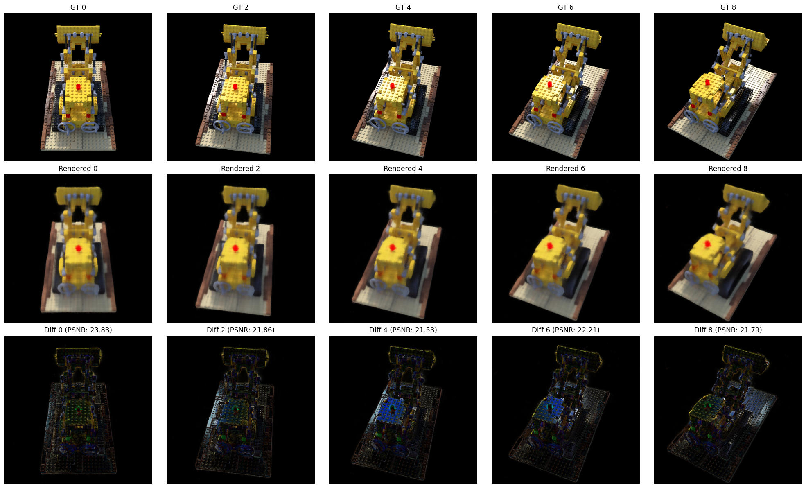

# NeRF实验复现

## 介绍

NeRF的含义是Neural Radiance Field,即神经辐射场。通过一组拍摄静态场景的照片，NeRF可以推断场景中物体的形状和色彩。训练成功的模型可以以摄像机位置和角度为参数，清晰地还原物体的图像。

NeRF的特点在于不借助3D模型，不记忆物体的材质信息，直接对物体进行渲染。局限性在于训练速度慢，并且只能用于静态物体，难以还原镜面物体。

下面我使用Colab对NeRF的原始模型进行还原，并剖析其原理和实现方法。

## 基本公式

NeRF使用的是体积光渲染公式。

$$
C(\mathbf{r})=\int_{t_n}^{t_f}T(t)\sigma({r}(t)){c}({r}(t),d)dt, \,            \mathrm{ where } \, T(t)=\exp\left(-\int_{t_n}^t\sigma({r}(s))ds\right)
$$

其中$C(r)$代表最终渲染的像素颜色；$T(t)$是从视线起点到视线终点未被吸收的概率，也就是从起始点出发的光线能够到达$t$的比例。$\sigma$是体素的体密度，代表射线在这一点被介质阻挡的概率。$c$代表体素的颜色。

其中

$$
T(t)=\exp\left(-\int_{t_n}^t\sigma({r}(s))ds\right)
$$

是从比尔-朗博定律而来：

$$
A = lg(1/T) = Kbc
$$

其中$A$代表吸光度，表示当前被吸收的光的强度， $T$代表透射比，与上文$T$含义相同。为了得到$T$，可以通过积分$\sigma$的方式得到$A$，再进行换算得到$T$。于是我们得到了上文计算$T$的公式。

为了使得$C(r)$能够在计算机中计算，必须将公式进行离散化。NeRF使用的方式是等间距地取若干个射线上的点进行计算，为了避免丢失模型信息，在采样点上会随机增加偏置距离。得到：

$$
\hat{C}({r})=\sum_{i=1}^NT_i(1-\exp(-\sigma_i\delta_i)){c}_i,\mathrm{~where~}T_i=\exp\left(-\sum_{j=1}^{i-1}\sigma_j\delta_j\right)
$$

其中$\delta_i$代表第$i$段的间距。$\sigma_i\delta_i$可表示当前段被吸收的光强度，再通过指数函数将其映射到(0,1]区间内，从而避免出现概率溢出与梯度消失。

在实际运算中，$\delta_i$和点的坐标、摄像机角度是已知量，模型的任务是通过点的坐标得到$\sigma$，并通过点的坐标和摄像机角度求得$c$。为此，NeRF使用了一个MLP模型，即多层感知机。MLP由多个全连接层组成，每一层都有一组神经元节点和非线性激活函数。



由于实际上模型要同时拟合两类数据，一是物体的体密度，二是物体的颜色，而物体的体密度只与点的坐标有关，与摄像机方向无关，物体颜色则与两者有关。NeRF分段加入参数并获取模拟结果。在模型的前八层，模型只会获得物体坐标作为参数，在后两层则会加入摄像机角度，并最终得到物体颜色。

通过提前计算摄像机的参数，可以获得每个摄像机的世界坐标。从这些坐标发射射线，可以得到射线的坐标与该坐标在图像上的像素坐标。从而NeRF可以使用坐标计算图像像素颜色，并与原图进行对比。

$$
\mathcal{L}=\sum_{\mathbf{r}\in\mathcal{R}}\left[\left\|\hat{C}_c(\mathbf{r})-C(\mathbf{r})\right\|_2^2+\left\|\hat{C}_f(\mathbf{r})-C(\mathbf{r})\right\|_2^2\right]
$$

NeRF采用MSE作为损失函数。其中$\hat{C}_c$与$\hat{C}_f$分别是粗略渲染与精细渲染的像素颜色。

为了让MLP更容易地学习函数特征，需要将高频参数进行低频化处理。在本实验中使用的处理方法是将坐标映射为正余弦周期函数，即

$$
\gamma(p)=\begin{pmatrix}\sin\left(2^0\pi p\right),\cos\left(2^0\pi p\right), \cdots,\sin\left(2^{L-1}\pi p\right),\cos\left(2^{L-1}\pi p\right)\end{pmatrix}.
$$

其中$p$代表原参数。在上图中可以看到最开始输入的是长度为60的参数。这是因为原始的(x,y,z)坐标通过上述方式映射为了60维的低频参数，$L$=10.而摄像机角度($\theta$,$\phi$)映射为了24维参数，L=6.
此外，为了避免因MLP层数过深，模型遗忘了原有参数特征，还会在第五层重新加入坐标参数强化记忆。

## 代码编写

本次实验在Colab平台上运行，使用的是与原文相同的lego图片作为数据。由于Colab上的python版本与相关库版本均已更新，需要重新编写适用于新版本的代码。

### 导入数据

首先，定义文件路径并导入相机参数：

```python
import os
import json

drive_base_path = '/content/drive/MyDrive/'
scene_name = 'lego'
nerf_synthetic_base_path = os.path.join(drive_base_path, 'nerf_synthetic')
dataset_path = os.path.join(nerf_synthetic_base_path, scene_name)

transforms_train_path = os.path.join(dataset_path, 'transforms_train.json')
transforms_val_path = os.path.join(dataset_path, 'transforms_val.json')
transforms_test_path = os.path.join(dataset_path, 'transforms_test.json')

def load_transforms_json(json_path):
    if os.path.exists(json_path):
        with open(json_path, 'r') as f:
            transforms_data = json.load(f)
        return transforms_data
    else:
        print(f"Error: {json_path} not found.")

transforms_train = load_transforms_json(transforms_train_path)
transforms_val = load_transforms_json(transforms_val_path)
transforms_test = load_transforms_json(transforms_test_path)
```

接下来定义图片的加载方法：

```python
import imageio.v2 as imageio
import numpy as np
import os

def load_images_from_frames(frames_data, base_path, num_samples):
    images = []
    image_paths = []
    print(f"Attempting to load {min(num_samples, len(frames_data))} images...")
    for i, frame in enumerate(frames_data):

        relative_image_path = frame['file_path']
        if relative_image_path.startswith('./'):
            relative_image_path = relative_image_path[2:]

        full_image_path = os.path.join(base_path, relative_image_path + '.png') 

        if os.path.exists(full_image_path):
            img = imageio.imread(full_image_path)
            images.append(img)
            image_paths.append(full_image_path)
            print(f"Loaded image: {full_image_path}")
    return images, image_paths

```

为了节省训练时间，下面对图片进行缩放。同时对图片进行归一化，以便后续计算：

```python
import numpy as np
import cv2 

original_H, original_W, _ = train_images[0].shape
target_H, target_W = original_H // 2, original_W 

processed_images = []

for i, img in enumerate(train_images):
    resized_img = cv2.resize(img, (target_W, target_H), interpolation=cv2.INTER_AREA)
    normalized_img = resized_img.astype(np.float32) / 255.0
    processed_images.append(normalized_img)

camera_angle_x = transforms_train['camera_angle_x']
focal_length_x_original = 0.5 * original_W / np.tan(0.5 * camera_angle_x)
scale_factor_w = target_W / original_W
scale_factor_h = target_H / original_H
focal_length_x_resized = focal_length_x_original * scale_factor_w

principal_point_x_resized = target_W / 2.0
principal_point_y_resized = target_H / 2.0
```

### 定义MLP

本文使用torch作为框架，下面定义的是坐标编码函数，用于将坐标转化为低频：

```python
import torch
import torch.nn as nn
import torch.nn.functional as F
import numpy as np

def get_positional_encoding_function(L_embed):
    def positional_encoding(input_coords):
        freq_bands = 2.**torch.linspace(0, L_embed - 1, L_embed, device=input_coords.device)
        freq_bands = freq_bands.view(L_embed, 1)
        encoded = input_coords.unsqueeze(-2) * freq_bands

        encoded_sin = torch.sin(encoded)
        encoded_cos = torch.cos(encoded)

        return torch.cat([input_coords.to(torch.float32), encoded_sin.flatten(-2, -1), encoded_cos.flatten(-2, -1)], dim=-1)

    return positional_encoding
```

下面是MLP的核心代码：

```python
class NeRF(nn.Module):
    def __init__(self, D=8, W=256, input_ch=63, input_ch_views=27, output_ch=4, skips=[4]):
        super(NeRF, self).__init__()
        self.D = D
        self.W = W
        self.input_ch = input_ch
        self.input_ch_views = input_ch_views
        self.skips = skips

        self.pts_linears = nn.ModuleList(
            [nn.Linear(input_ch, W)] + [nn.Linear(W, W) if i not in self.skips else nn.Linear(W + input_ch, W) for i in range(D-1)])

        self.views_linear = nn.Linear(input_ch_views + W, W // 2) 

        self.feature_linear = nn.Linear(W, W) 
        self.alpha_linear = nn.Linear(W, 1) 
        self.rgb_linear = nn.Linear(W // 2, 3) 

    def forward(self, x):
        input_pts, input_views = torch.split(x, [self.input_ch, self.input_ch_views], dim=-1)

        h = input_pts
        for i, l in enumerate(self.pts_linears):
            h = self.pts_linears[i](h)
            h = F.relu(h)
            if i in self.skips:
                h = torch.cat([input_pts, h], -1)

        alpha = self.alpha_linear(h)
        feature = self.feature_linear(h)

        h = torch.cat([feature, input_views], -1)
        h = F.relu(self.views_linear(h))

        rgb = self.rgb_linear(h)

        return torch.cat([rgb, alpha], -1)

```

下面是射线生成函数与渲染函数：

```python
def get_rays(H, W, focal, c2w):
    i, j = torch.meshgrid(torch.linspace(0, W - 1, W), torch.linspace(0, H - 1, H))
    i = i.t()
    j = j.t()

    dirs = torch.stack([(i - W * .5) / focal, -(j - H * .5) / focal, -torch.ones_like(i)], -1)
    rays_d = torch.sum(dirs[..., None, :] * c2w[:3, :3], -1)
    rays_o = c2w[:3, -1].expand(rays_d.shape)
    return rays_o, rays_d
    
def raw2outputs(raw, z_vals, rays_d):
    raw2alpha = lambda raw, dists, act_fn: 1. - torch.exp(-act_fn(raw) * dists)

    dists = z_vals[..., 1:] - z_vals[..., :-1]
    dists = torch.cat([dists, torch.Tensor([1e10]).expand(dists[..., :1].shape)], -1)  

    rgb = torch.sigmoid(raw[..., :3])
    alpha = raw2alpha(raw[..., 3], dists, F.relu)

    weights = alpha * torch.cumprod(torch.cat([torch.ones((alpha.shape[0], 1), device=alpha.device), 1.-alpha + 1e-10], -1), -1)[..., :-1]

    rgb_map = torch.sum(weights[..., None] * rgb, -2)  
    depth_map = torch.sum(weights * z_vals, -1) 
    disp_map = 1./torch.max(1e-10 * torch.ones_like(depth_map), depth_map / torch.sum(weights, -1))
    acc_map = torch.sum(weights, -1) 

    return rgb_map, disp_map, acc_map, weights, depth_map

```

接下来对上述函数进行整合，形成一个完整的渲染函数：

```python
def render_rays(ray_batch,
              network_fn, 
              network_query_fn, # Helper function to query the MLP
              N_samples, # Number of samples per ray
              retraw=False, # Return raw NeRF output
              lindisp=False, # Sample linearly in inverse depth
              perturb=0., # Add noise to sampling
              N_importance=0, # Number of importance samples (for fine model)
              network_fine=None, # NeRF MLP (fine)
              white_bkgd=False, # Render white background
              raw_noise_std=0., # Add noise to raw density
              verbose=False,
              pytest=False,
              near=None, far=None): # Near and far bounds for sampling

    N_rays = ray_batch.shape[0]
    rays_o, rays_d = ray_batch[:, 0:3], ray_batch[:, 3:6]
    viewdirs = ray_batch[:, -3:] if ray_batch.shape[-1] > 9 else None 
    bounds = ray_batch[:, 6:8]
    near, far = bounds[:, 0], bounds[:, 1]

    if viewdirs is not None:
        viewdirs = viewdirs / torch.norm(viewdirs, dim=-1, keepdim=True)

    def sample_points_on_rays_revised(rays_o, rays_d, near, far, N_samples, perturb):
        t_vals = torch.linspace(0., 1., steps=N_samples, device=rays_o.device)
        if lindisp: 
            z_vals = 1./(1./near * (1.-t_vals) + 1./far * (t_vals))
        else:
            z_vals = near * (1.-t_vals) + far * (t_vals)

        if perturb > 0.:
            mids = .5 * (z_vals[..., 1:] + z_vals[..., :-1])
            upper = torch.cat([mids, z_vals[..., -1:]], -1)
            lower = torch.cat([z_vals[..., :1], mids], -1)
            t_rand = torch.rand(z_vals.shape, device=rays_o.device)
            z_vals = lower + (upper - lower) * t_rand

        z_vals = z_vals.expand([N_rays, N_samples]) 
        points = rays_o[..., None, :] + rays_d[..., None, :] * z_vals[..., :, None]
        return points, z_vals

    pts, z_vals = sample_points_on_rays_revised(rays_o, rays_d, near, far, N_samples, perturb)

    raw = network_query_fn(pts, viewdirs, network_fn) 
    rgb_map, disp_map, acc_map, weights, depth_map = raw2outputs(raw, z_vals, rays_d)
    if white_bkgd:
        rgb_map = rgb_map + (1. - acc_map[..., None]) 
    ret = {
        'rgb_map': rgb_map,
        'disp_map': disp_map,
        'acc_map': acc_map,
        'z_vals': z_vals,
        'weights': weights
    }

    if N_importance > 0 and network_fine is not None:
        pts_mid = .5 * (z_vals[..., 1:] + z_vals[..., :-1])
        z_samples = sample_pdf(pts_mid, weights[..., 1:-1], N_importance, det=(perturb==0.), pytest=pytest)
        z_samples = z_samples.detach()

        z_vals_fine, _ = torch.sort(torch.cat([z_vals, z_samples], -1), -1)
        pts_fine = rays_o[..., None, :] + rays_d[..., None, :] * z_vals_fine[..., :, None]

        raw_fine = network_query_fn(pts_fine, viewdirs, network_fine)
        rgb_map_fine, disp_map_fine, acc_map_fine, weights_fine, depth_map_fine = raw2outputs(raw_fine, z_vals_fine, rays_d)

        if white_bkgd:
            rgb_map_fine = rgb_map_fine + (1. - acc_map_fine[..., None])

        ret['rgb_map_0'] = rgb_map
        ret['disp_map_0'] = disp_map
        ret['acc_map_0'] = acc_map
        ret['rgb_map'] = rgb_map_fine
        ret['disp_map'] = disp_map_fine
        ret['acc_map'] = acc_map_fine
        ret['z_vals_fine'] = z_vals_fine

    return ret

def batchify_rays(rays, chunk=1024*32):
    all_ret = {}
    for i in range(0, rays.shape[0], chunk):
        ret = render_rays(rays[i:i+chunk])
        for k in ret:
            if k not in all_ret:
                all_ret[k] = []
            all_ret[k].append(ret[k])
    all_ret = {k : torch.cat(all_ret[k], 0) for k in all_ret}
    return all_ret

def render(H, W, focal, c2w, near, far, chunk=1024*32, 
           rays=None, verbose=False, pytest=False):

    if c2w is not None:
        rays_o, rays_d = get_rays(H, W, focal, c2w)
    else:
        rays_o, rays_d = rays

    rays_o = rays_o.reshape(-1, 3)
    rays_d = rays_d.reshape(-1, 3)

    viewdirs = rays_d / torch.norm(rays_d, dim=-1, keepdim=True)

    rays = torch.cat([rays_o, rays_d,
                      near*torch.ones_like(rays_o[:, :1]), far*torch.ones_like(rays_o[:, :1]),
                      viewdirs], -1)

    all_ret = batchify_rays(rays, chunk)
    for k in all_ret:
        k_unflat = all_ret[k].reshape(H, W, -1)
        all_ret[k] = k_unflat

    return all_ret

def network_query_fn(pts, viewdirs, network_fn):
    pos_enc_fn_coords = get_positional_encoding_function(L_embed=10) 
    pos_enc_fn_views = get_positional_encoding_function(L_embed=4)  

    pts_flat = pts.reshape(-1, pts.shape[-1])
    viewdirs_flat = viewdirs[:, None].expand(pts.shape).reshape(-1, viewdirs.shape[-1]) 

    embedded_pts = pos_enc_fn_coords(pts_flat)
    embedded_viewdirs = pos_enc_fn_views(viewdirs_flat)

    network_input = torch.cat([embedded_pts, embedded_viewdirs], -1)

    raw_output = network_fn(network_input)

    return raw_output.reshape(list(pts.shape[:-1]) + [raw_output.shape[-1]])

def sample_pdf(bins, weights, N_samples, det=False, pytest=False):

    weights = weights + 1e-5 
    pdf = weights / torch.sum(weights, -1, keepdim=True)
    cdf = torch.cumsum(pdf, -1)
    cdf = torch.cat([torch.zeros_like(cdf[..., :1]), cdf], -1)  
    
    if det:
        u = torch.linspace(0., 1., steps=N_samples, device=bins.device)
        u = u.expand(list(cdf.shape[:-1]) + [N_samples])
    else:
        u = torch.rand(list(cdf.shape[:-1]) + [N_samples], device=bins.device)

    u = u.contiguous()
    inds = torch.searchsorted(cdf, u, right=True)

    below = torch.max(torch.zeros_like(inds - 1), inds - 1)
    above = torch.min((cdf.shape[-1] - 1) * torch.ones_like(inds), inds)
    inds_g = torch.stack([below, above], -1)  # (batch, N_samples, 2)

    matched_shape = [inds_g.shape[0], inds_g.shape[1], cdf.shape[-1]]
    cdf_g = torch.gather(cdf.unsqueeze(1).expand(matched_shape), 2, inds_g)
    bins_g = torch.gather(bins.unsqueeze(1).expand(matched_shape), 2, inds_g)

    denom = (cdf_g[..., 1] - cdf_g[..., 0])
    denom = torch.where(denom < 1e-5, torch.ones_like(denom), denom)
    t = (u - cdf_g[..., 0]) / denom
    samples = bins_g[..., 0] + t * (bins_g[..., 1] - bins_g[..., 0])

    return samples
```

### 模型训练

模型与相关函数均已完成定义，下面先对训练所需超参数进行定义，然后进行训练：

```python
device = torch.device("cuda" if torch.cuda.is_available() else "cpu")

D = 8 
W = 256 
L_embed_coords = 10 
L_embed_views = 4  

input_ch_coords = 3 * (2 * L_embed_coords + 1) 
input_ch_views = 3 * (2 * L_embed_views + 1)   

N_samples = 64        
N_importance = 128    
chunk = 1024 * 4      
perturb = 1.0         
use_viewdirs = True   
white_bkgd = True     
precrop_iters = 500  
precrop_frac = 0.5    

lr = 5e-4             
lr_decay = 250000    
lr_decay_factor = 0.1

pos_enc_coords_fn = get_positional_encoding_function(L_embed_coords)
pos_enc_views_fn = get_positional_encoding_function(L_embed_views)

def network_query_fn_configured(pts, viewdirs, network_fn):
    pts_flat = pts.reshape(-1, pts.shape[-1])
    if use_viewdirs and viewdirs is not None:
        viewdirs_flat = viewdirs[:, None].expand(pts.shape).reshape(-1, viewdirs.shape[-1])
        embedded_pts = pos_enc_coords_fn(pts_flat)
        embedded_viewdirs = pos_enc_views_fn(viewdirs_flat)
        network_input = torch.cat([embedded_pts, embedded_viewdirs], -1)
    else:
        embedded_pts = pos_enc_coords_fn(pts_flat)
        network_input = embedded_pts

    raw_output = network_fn(network_input)
    return raw_output.reshape(list(pts.shape[:-1]) + [raw_output.shape[-1]])

model = NeRF(D=D, W=W, input_ch=input_ch_coords, input_ch_views=input_ch_views if use_viewdirs else 0, skips=[4]).to(device)
model_fine = None
if N_importance > 0:
    model_fine = NeRF(D=D, W=W, input_ch=input_ch_coords, input_ch_views=input_ch_views if use_viewdirs else 0, skips=[4]).to(device)

optimizer = torch.optim.Adam(list(model.parameters()) + list(model_fine.parameters()) if model_fine else list(model.parameters()), lr=lr)
```

```python
import torch
import torch.nn as nn
import torch.nn.functional as F
import numpy as np
import imageio.v2 as imageio
import cv2
import time
import os

def get_rays_batch(H, W, focal, c2w, coords):
    device = c2w.device
    i_coords = coords[:, 0].float()
    j_coords = coords[:, 1].float()

    focal_tensor = torch.tensor(focal, device=device, dtype=torch.float32)
    dirs = torch.stack([(j_coords - W * .5) / focal_tensor,
                        -(i_coords - H * .5) / focal_tensor,
                        -torch.ones_like(i_coords)], -1) # dirs shape: (N_batch, 3)

    rays_d = torch.sum(dirs[..., None, :] * c2w[:3, :3], -1
    rays_o = c2w[:3, -1].expand(rays_d.shape)

    return rays_o, rays_d

training_images = []
training_poses = []
focal_resized = 0.5 * target_W / np.tan(0.5 * camera_angle_x)

for i, frame in enumerate(transforms_train['frames']):
    relative_image_path = frame['file_path']
    if relative_image_path.startswith('./'):
        relative_image_path = relative_image_path[2:]
    full_image_path = os.path.join(dataset_path, relative_image_path + '.png')
    img = imageio.imread(full_image_path)
    resized_img = cv2.resize(img, (target_W, target_H), interpolation=cv2.INTER_AREA)
    normalized_img = resized_img.astype(np.float32) / 255.0
    training_images.append(torch.tensor(normalized_img, dtype=torch.float32)) 

    pose = np.array(frame['transform_matrix'], dtype=np.float32)
    training_poses.append(torch.tensor(pose, dtype=torch.float32)) 
    
training_images = torch.stack(training_images) # (N, H, W, 4) or (N, H, W, 3)
training_poses = torch.stack(training_poses)   # (N, 4, 4)

print(f"Loaded {len(training_images)} training images and poses.")
print(f"Training images shape: {training_images.shape}")
print(f"Training poses shape: {training_poses.shape}")

near_bound = 2.0
far_bound = 6.0

N_iters = 10000
criterion = nn.MSELoss()

psnrs = []
iternums = []

model.train()
if model_fine:
    model_fine.train()

def get_lr(iteration, initial_lr, lr_decay, lr_decay_factor):
    new_lr = initial_lr * (lr_decay_factor ** (iteration / lr_decay))
    return new_lr

N_samples = 32     
N_importance = 64   
chunk = 1024        
netchunk = 1024     

def network_query_fn_configured(pts, viewdirs, network_fn):
    pts_flat = pts.reshape(-1, pts.shape[-1])

    if use_viewdirs and viewdirs is not None:
   
        viewdirs_flat = viewdirs[:, None].expand(pts.shape).reshape(-1, viewdirs.shape[-1])
        embedded_pts = pos_enc_coords_fn(pts_flat)
        embedded_viewdirs = pos_enc_views_fn(viewdirs_flat)
        network_input = torch.cat([embedded_pts, embedded_viewdirs], -1)
    else:
        embedded_pts = pos_enc_coords_fn(pts_flat)
        network_input = embedded_pts

    raw_outputs = []
    for i in range(0, network_input.shape[0], netchunk):
        raw_outputs.append(network_fn(network_input[i:i+netchunk]))
    raw_output = torch.cat(raw_outputs, 0)

    return raw_output.reshape(list(pts.shape[:-1]) + [raw_output.shape[-1]])

scaler = torch.amp.GradScaler('cuda') 
start_time = time.time()

for i in range(N_iters):

    if torch.cuda.is_available():
        torch.cuda.empty_cache()

    img_idx = np.random.randint(0, len(training_images))
    target_img = training_images[img_idx].to(device) 
    target_pose = training_poses[img_idx].to(device) 
    H, W = target_img.shape[:2] 
    if i < precrop_iters:
        dH = int(H // 2 * precrop_frac)
        dW = int(W // 2 * precrop_frac)
     
        coords_x = torch.linspace(H//2 - dH, H//2 + dH - 1, 2*dH, device=device)
        coords_y = torch.linspace(W//2 - dW, W//2 + dW - 1, 2*dW, device=device)
        coords = torch.stack(torch.meshgrid(coords_x, coords_y, indexing='ij'), -1)
        if i == 0:
          
    else:
        coords_x = torch.linspace(0, H - 1, H, device=device)
        coords_y = torch.linspace(0, W - 1, W, device=device)
        coords = torch.stack(torch.meshgrid(coords_x, coords_y, indexing='ij'), -1)

    coords = coords.reshape(-1, 2) 
    select_inds = np.random.choice(coords.shape[0], size=[chunk], replace=False) 
    select_coords = coords[select_inds].long() 

    rays_o, rays_d = get_rays_batch(H, W, focal_resized, target_pose, select_coords)

    viewdirs = rays_d / torch.norm(rays_d, dim=-1, keepdim=True)

    batch_rays = torch.cat([
        rays_o,
        rays_d,
       
        torch.tensor(near_bound, device=device, dtype=torch.float32) * torch.ones_like(rays_o[:, :1]),
        torch.tensor(far_bound, device=device, dtype=torch.float32) * torch.ones_like(rays_o[:, :1]),
        viewdirs
    ], -1)

    target_rgb_full = target_img[..., :3].reshape(-1, 3) # (H*W, 3)
    rays_flat_idx = select_coords[:, 0] * W + select_coords[:, 1]
    target_rgb_batch = target_rgb_full[rays_flat_idx]

    with torch.cuda.amp.autocast():
        ret = render_rays(batch_rays,
                          network_fn=model,
                          network_query_fn=network_query_fn_configured,
                          N_samples=N_samples,
                          perturb=perturb,
                          N_importance=N_importance,
                          network_fine=model_fine,
                          white_bkgd=white_bkgd)

        rgb_map = ret['rgb_map']
        loss = criterion(rgb_map, target_rgb_batch)

    optimizer.zero_grad()
    scaler.scale(loss).backward()
    scaler.step(optimizer)
    scaler.update()

    new_lr = get_lr(i, lr, lr_decay, lr_decay_factor)
    for param_group in optimizer.param_groups:
        param_group['lr'] = new_lr

    if i % 100 == 0:
        psnr = -10. * torch.log10(loss) 
        print(f"[Iter {i}] Loss: {loss.item():.4f}, PSNR: {psnr.item():.2f}, LR: {new_lr:.6f}")
        psnrs.append(psnr.item())
        iternums.append(i)

    if i % 1000 == 0 and i > 0:
        checkpoint_dir = os.path.join(drive_base_path, 'nerf_checkpoints')
        os.makedirs(checkpoint_dir, exist_ok=True)
        path = os.path.join(checkpoint_dir, f'{scene_name}_{i:06d}.tar')
        torch.save({
            'iter': i,
            'model_state_dict': model.state_dict(),
            'model_fine_state_dict': model_fine.state_dict() if model_fine else None,
            'optimizer_state_dict': optimizer.state_dict(),
            'psnrs': psnrs,
            'iternums': iternums,
        }, path)
        print(f"Saved checkpoint to {path}")

end_time = time.time()
training_duration_minutes = (end_time - start_time) / 60.0
print(f"\nTraining complete!")
print(f"Total training duration: {training_duration_minutes:.2f} minutes")
print(f"Final Loss: {loss.item():.4f}")
print(f"Final PSNR: {psnrs[-1]:.2f}")
```

### 模型评估

```python
import torch
import numpy as np
import imageio.v2 as imageio
import cv2
import os
import json
import matplotlib.pyplot as plt

test_images_cpu = []
test_poses_cpu = []

model.eval()
if model_fine:
    model_fine.eval()

def get_rays_for_full_image(H, W, focal, c2w):
    device = c2w.device 
    i, j = torch.meshgrid(torch.linspace(0, W - 1, W, device=device),
                          torch.linspace(0, H - 1, H, device=device),
                          indexing='ij')
    i = i.t() 
    j = j.t()

    focal_tensor = torch.tensor(focal, device=device, dtype=torch.float32)

    dirs = torch.stack([(j - W * .5) / focal_tensor, -(i - H * .5) / focal_tensor, -torch.ones_like(i)], -1)
    rays_d = torch.sum(dirs[..., None, :] * c2w[:3, :3], -1)
    rays_o = c2w[:3, -1].expand(rays_d.shape)
    return rays_o, rays_d

def batchify_rays_eval(rays_flat, chunk, network_fn, network_fine, network_query_fn, N_samples, N_importance, white_bkgd, perturb=0., lindisp=False):
    all_ret = {}
    for i in range(0, rays_flat.shape[0], chunk):
        ret = render_rays(
            rays_flat[i:i+chunk],
            network_fn=network_fn,
            network_query_fn=network_query_fn,
            N_samples=N_samples,
            perturb=perturb,
            N_importance=N_importance,
            network_fine=network_fine,
            white_bkgd=white_bkgd,
            lindisp=lindisp
        )
        for k in ret:
            if k not in all_ret:
                all_ret[k] = []
            all_ret[k].append(ret[k])

    all_ret = {k : torch.cat(all_ret[k], 0) for k in all_ret}
    return all_ret

def render_full_image(H, W, focal, c2w, near_bound, far_bound, network_fn, network_fine, network_query_fn, chunk_size, N_samples, N_importance, white_bkgd):
    rays_o, rays_d = get_rays_for_full_image(H, W, focal, c2w)

    rays_o_flat = rays_o.reshape(-1, 3)
    rays_d_flat = rays_d.reshape(-1, 3)
    viewdirs = rays_d_flat / torch.norm(rays_d_flat, dim=-1, keepdim=True)

    rays_batch_all = torch.cat([
        rays_o_flat,
        rays_d_flat,
        torch.tensor(near_bound, device=device, dtype=torch.float32) * torch.ones_like(rays_o_flat[:, :1]),
        torch.tensor(far_bound, device=device, dtype=torch.float32) * torch.ones_like(rays_o_flat[:, :1]),
        viewdirs
    ], -1)
    
    with torch.no_grad():
        rgb_outputs = batchify_rays_eval(
            rays_batch_all,
            chunk_size,
            network_fn,
            network_fine,
            network_query_fn,
            N_samples,
            N_importance,
            white_bkgd
        )

    rgb_map = rgb_outputs['rgb_map'].reshape(H, W, 3) 
    return rgb_map
```

```python
import torch
import torch.nn as nn
import torch.nn.functional as F
import numpy as np
import imageio.v2 as imageio
import cv2
import time
import os
import json
import matplotlib.pyplot as plt

test_images_cpu = []
test_poses_cpu = []

nerf_synthetic_base_path = os.path.join(drive_base_path, 'nerf_synthetic') 
dataset_path = os.path.join(nerf_synthetic_base_path, scene_name)
transforms_test_path = os.path.join(dataset_path, 'transforms_test.json')
def load_transforms_json(json_path):
    if os.path.exists(json_path):
        with open(json_path, 'r') as f:
            transforms_data = json.load(f)
        print(f"Successfully loaded {json_path}")
        return transforms_data
    else:
        print(f"Error: {json_path} not found.")
        return None

transforms_test = load_transforms_json(transforms_test_path)

if transforms_test: 
    for frame in transforms_test['frames']:
        relative_image_path = frame['file_path']
        if relative_image_path.startswith('./'):
            relative_image_path = relative_image_path[2:]
        full_image_path = os.path.join(dataset_path, relative_image_path + '.png')

        if os.path.exists(full_image_path):
            img = imageio.imread(full_image_path)
         
            resized_img = cv2.resize(img, (target_W, target_H), interpolation=cv2.INTER_AREA)
            normalized_img = resized_img.astype(np.float32) / 255.0
            test_images_cpu.append(torch.tensor(normalized_img, dtype=torch.float32)) 

            pose = np.array(frame['transform_matrix'], dtype=np.float32)
            test_poses_cpu.append(torch.tensor(pose, dtype=torch.float32)) 
        else:
            print(f"Warning: Test image not found at {full_image_path}, skipping.")

N_samples_eval = 64      
N_importance_eval = 128  
chunk_size_eval = 4096   
netchunk_eval = 8192    

rendered_images = []
psnrs_eval = []

if len(test_images_cpu) > 0:
    for i in range(len(test_images_cpu)):

        if torch.cuda.is_available():
            torch.cuda.empty_cache()

        test_img_gt = test_images_cpu[i].to(device) 
        test_pose = test_poses_cpu[i].to(device)   

        H, W = test_img_gt.shape[:2]

        rgb_map_rendered = render_full_image(
            H, W, focal_resized, test_pose, near_bound, far_bound,
            network_fn=model,
            network_fine=model_fine,
            network_query_fn=network_query_fn_configured,
            chunk_size=chunk_size_eval, 
            N_samples=N_samples_eval,
            N_importance=N_importance_eval,
            white_bkgd=white_bkgd
        )

        rgb_map_rendered_np = rgb_map_rendered.cpu().numpy() 
        rendered_images.append(rgb_map_rendered_np)

        mse = torch.mean((rgb_map_rendered - test_img_gt[..., :3]) ** 2)
        psnr = -10. * torch.log10(mse)
        psnrs_eval.append(psnr.item())

        if i % 10 == 0:
            
    num_display = min(5, len(rendered_images)) 
    plt.figure(figsize=(num_display * 4, 12))

    for i in range(num_display):
        idx = i * (len(rendered_images) // num_display) if num_display > 0 else 0 
        plt.subplot(3, num_display, i + 1)
        plt.imshow(test_images_cpu[idx][..., :3].numpy())
        plt.title(f"GT {idx}")
        plt.axis('off')

        plt.subplot(3, num_display, num_display + i + 1)
        plt.imshow(rendered_images[idx])
        plt.title(f"Rendered {idx}")
        plt.axis('off')

        plt.subplot(3, num_display, 2 * num_display + i + 1)
        diff_img = np.abs(rendered_images[idx] - test_images_cpu[idx][..., :3].numpy()) 
        plt.imshow(diff_img)
        plt.title(f"Diff {idx} (PSNR: {psnrs_eval[idx]:.2f})")
        plt.axis('off')

    plt.tight_layout()
    plt.show()
    mean_psnr = np.mean(psnrs_eval)
    print(f"\nAverage PSNR across the test set: {mean_psnr:.2f}")
else:
    print("Skipping evaluation and visualization as no test images were loaded.")
    print("Please ensure 'transforms_test.json' exists at the specified path and contains valid data.")
```

可以得到结果：



注：在评估阶段，可能会出现图片翻转、空白的可能，这是因为在输出图片时错误的进行了转置，以及使用的设备不统一（cpu和gpu）。